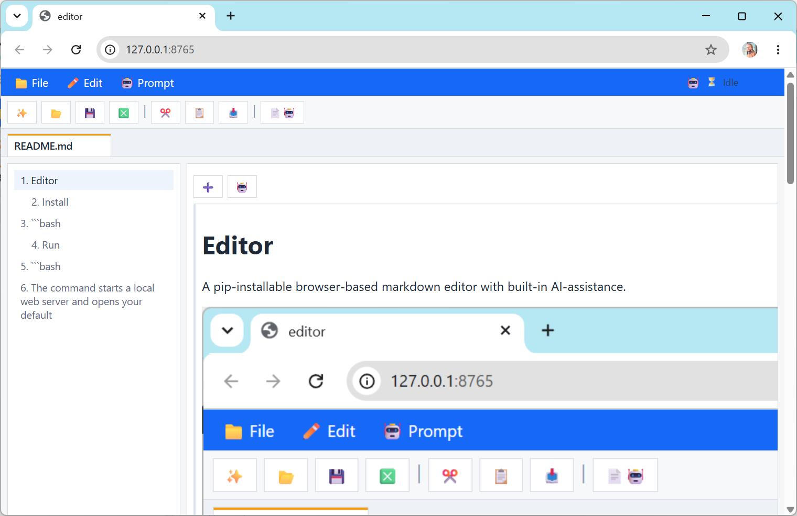

# Editor

A pip-installable browser-based markdown editor with built-in AI-assistance.



## Install

```bash
git clone https://github.com/haesleinhuepf/editor
cd editor
pip install -e .
```

## Run

```bash
editor
editor notes.md
```

The command starts a local web server and opens your default browser.
